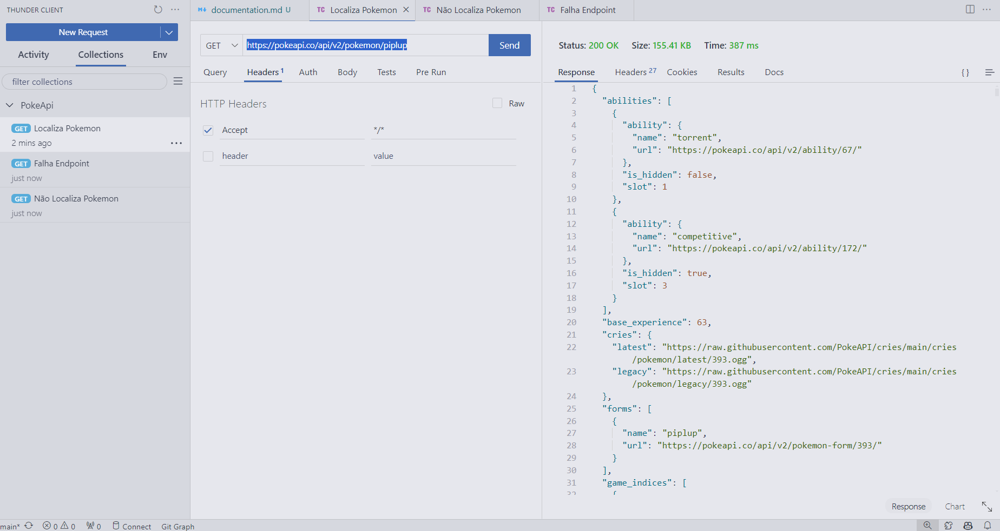
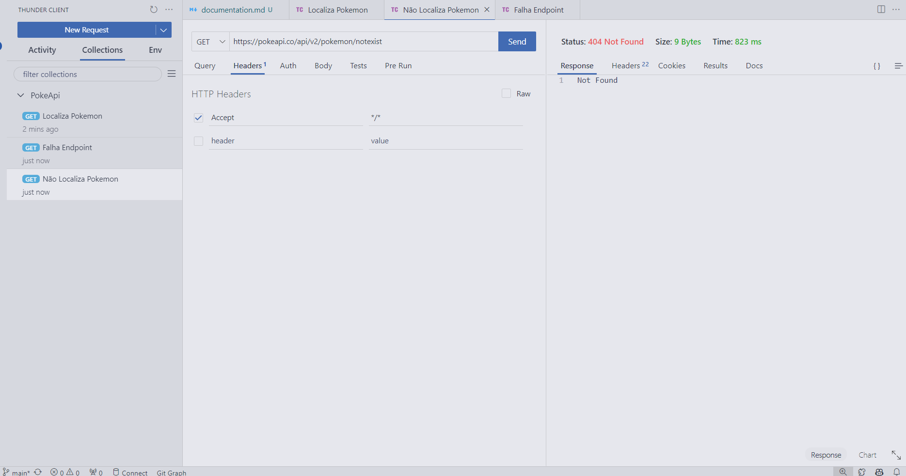
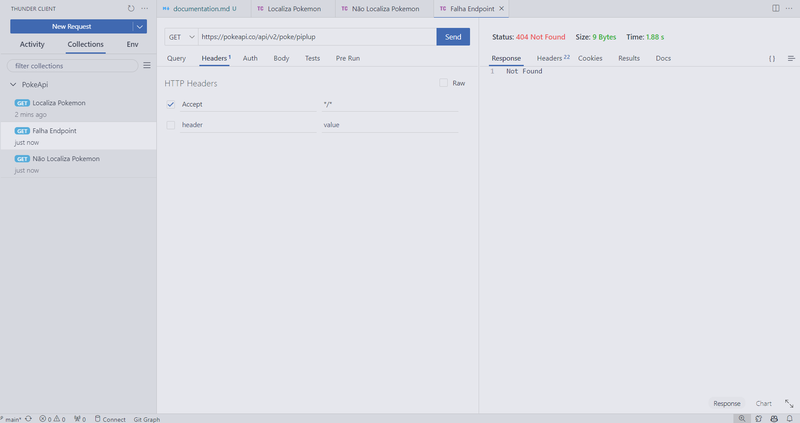

### Documentação de Testes de Endpoints

Para este exemplo, escolhi utilizar o **ThunderClient**. Ele oferece funcionalidades semelhantes ao Postman, mas é mais fácil de instalar (extensão do VSCode), configurar e possui uma interface mais amigável.

#### Testes de Endpoints

##### Teste de Sucesso
Os testes a seguir verificam a busca de dados corretamente a partir da API do PokeAPI (pokeapi.co):

##### Teste de Endpoint Inexistente
Os testes a seguir demonstram a falha ao tentar buscar dados de um endpoint inexistente:

##### Teste de Endpoint Mal Formatado
Os testes a seguir mostram a falha ao tentar buscar dados de um endpoint mal formatado:

