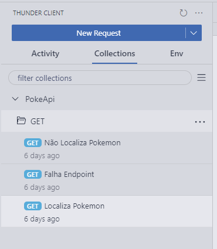
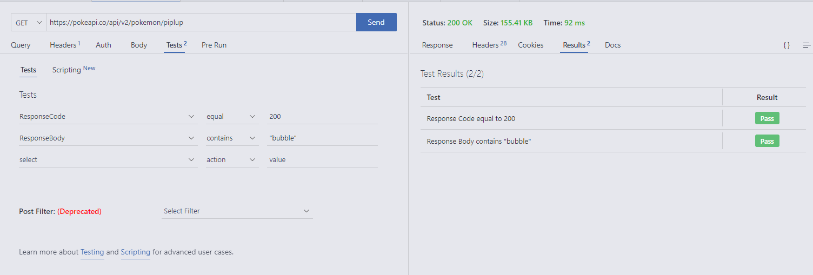
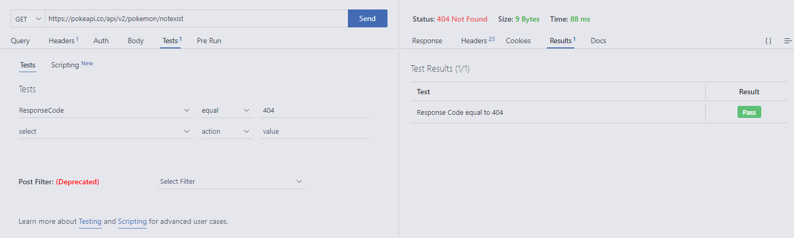
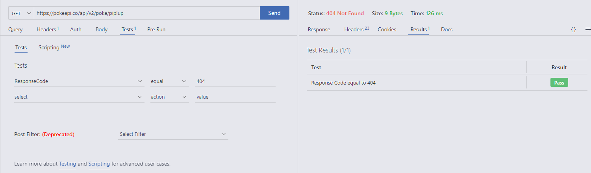
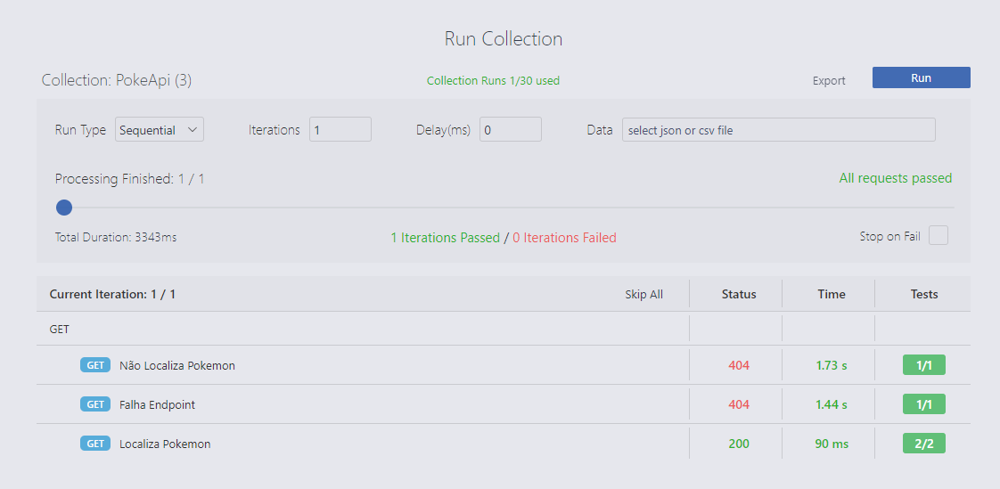
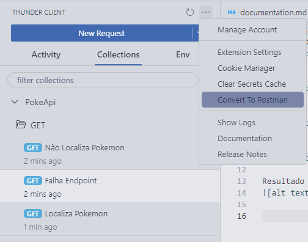
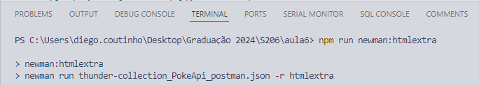
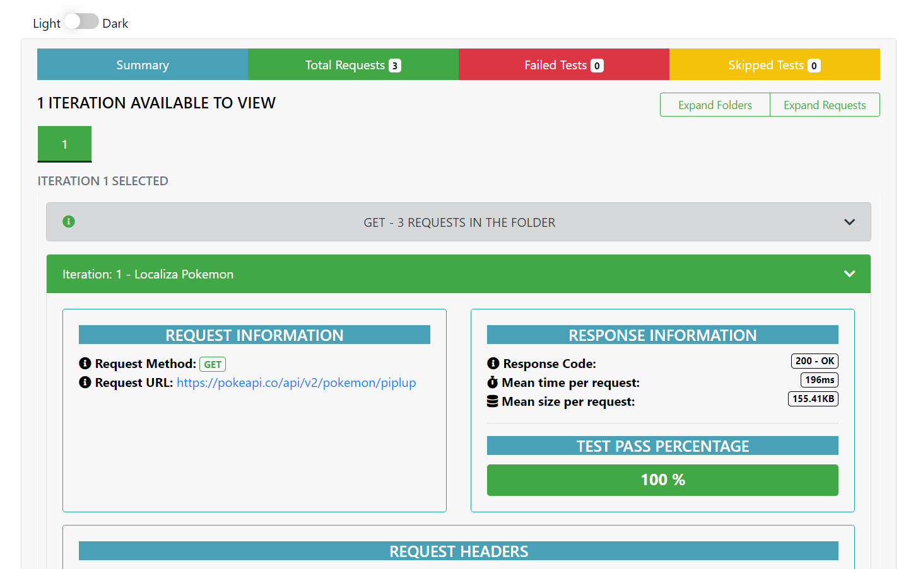

### Documentação de Testes de Endpoints

Para este exemplo, utilizou-se o ThunderClient. Ele oferece funcionalidades semelhantes ao Postman, mas é mais fácil de instalar, configurar e possui uma interface mais amigável.

#### Testes de Endpoints

##### Organização dos testes em pastas
Os testes foram organizados em pastas, de acordo com a coleção de testes. A pasta GET contém os arquivos dos testes da aula 6.



##### Teste de Sucesso
Os testes a seguir verificam a busca de dados corretamente a partir da API do PokeAPI (pokeapi.co):



##### Teste de Endpoint Inexistente
Os testes a seguir demonstram a falha ao tentar buscar dados de um endpoint inexistente:



##### Teste de Endpoint Mal Formatado
Os testes a seguir mostram a falha ao tentar buscar dados de um endpoint mal formatado:




#### Resultado da Execução

##### Resultado da Execução da Collection no ThunderClient


##### Exportação para Postman (JSON)


##### Teste Executado via Newman (htmlextra) com npx


##### HTML Exportado do Reporter após Execução do Newman


### Como Executar os Testes com Newman

Para executar os testes usando o Newman, você pode usar o seguinte comando:

```sh
npx newman run thunder-collection_PokeApi_postman.json -r htmlextra
```

Ou simplesmente (neste projeto):

```sh
npm run newman:htmlextra
```

Este comando executará os testes definidos na coleção e gerará um relatório HTML usando o reporter `htmlextra`.